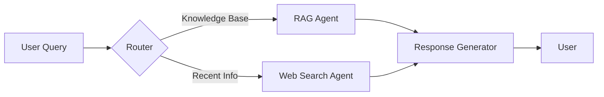

LLM 기반 애플리케이션이 복잡해지면서 단일 에이전트로는 해결하기 어려운 문제들이 생겨나고 있습니다. 
이번 글에서는 **LangGraph**를 활용해 멀티 에이전트 시스템을 구축한 경험을 SenPick 프로젝트 사례를 통해 공유합니다.

---

## 🤔 LangGraph vs LangChain: 왜 LangGraph인가?

**LangChain**은 체인 기반 접근으로 간단한 워크플로우에 적합하지만, 복잡한 분기 처리나 상태 관리에는 한계가 있습니다.

**LangGraph**는 상태 그래프(State Graph) 기반으로:
- ✅ 복잡한 조건 분기 처리 가능
- ✅ 에이전트 간 상태 공유 및 동기화
- ✅ 사이클(Cycle)을 통한 반복 처리
- ✅ 체크포인트 기반 에러 복구

```python
from langgraph.graph import StateGraph, END
from typing import TypedDict

class AgentState(TypedDict):
    messages: list
    next: str
    context: dict
```

---

## 🏗️ State Graph 아키텍처 설계

SenPick에서는 사용자 질문을 처리하기 위해 다음과 같은 멀티 에이전트 구조를 설계했습니다:



**핵심 노드**:
1. **Router**: 질문 유형 분석 및 라우팅
2. **RAG Agent**: 벡터 DB 검색 및 컨텍스트 추출
3. **Web Search Agent**: 실시간 정보 검색
4. **Response Generator**: 최종 응답 생성

---

## 💻 멀티 에이전트 구현 예시

### 1. 상태 정의

```python
from typing import TypedDict, List, Annotated
from operator import add

class MultiAgentState(TypedDict):
    query: str
    messages: Annotated[List[str], add]
    rag_context: str
    web_context: str
    route: str
    final_response: str
```

### 2. Router 구현

```python
def router_node(state: MultiAgentState) -> MultiAgentState:
    """질문 유형을 분석하여 적절한 에이전트로 라우팅"""
    query = state["query"]
    
    # GPT-4를 사용한 라우팅 결정
    prompt = f"""
    다음 질문이 지식 베이스(Knowledge Base)에서 답할 수 있는지,
    아니면 최신 정보(Web Search)가 필요한지 판단하세요.
    
    질문: {query}
    
    답변 형식: "KB" 또는 "WEB"
    """
    
    route = llm.invoke(prompt).content.strip()
    state["route"] = route
    
    return state
```

### 3. RAG Agent

```python
def rag_agent_node(state: MultiAgentState) -> MultiAgentState:
    """Qdrant 벡터 DB에서 관련 문서 검색"""
    query = state["query"]
    
    # 벡터 검색
    results = qdrant_client.search(
        collection_name="senpick_docs",
        query_vector=embed_query(query),
        limit=5
    )
    
    # 컨텍스트 구성
    context = "\n\n".join([r.payload["content"] for r in results])
    state["rag_context"] = context
    state["messages"].append(f"RAG Agent: 관련 문서 {len(results)}개 검색 완료")
    
    return state
```

### 4. Web Search Agent

```python
def web_search_agent_node(state: MultiAgentState) -> MultiAgentState:
    """Tavily API를 사용한 웹 검색"""
    query = state["query"]
    
    # 웹 검색 수행
    search_results = tavily_client.search(query, max_results=3)
    
    # 검색 결과 요약
    context = "\n\n".join([
        f"제목: {r['title']}\n내용: {r['content']}"
        for r in search_results["results"]
    ])
    
    state["web_context"] = context
    state["messages"].append(f"Web Search Agent: 검색 결과 {len(search_results['results'])}개 수집")
    
    return state
```

### 5. Graph 구성

```python
workflow = StateGraph(MultiAgentState)

# 노드 추가
workflow.add_node("router", router_node)
workflow.add_node("rag_agent", rag_agent_node)
workflow.add_node("web_search_agent", web_search_agent_node)
workflow.add_node("response_generator", response_generator_node)

# 엣지 정의
workflow.set_entry_point("router")

def route_decision(state):
    return "rag_agent" if state["route"] == "KB" else "web_search_agent"

workflow.add_conditional_edges(
    "router",
    route_decision,
    {
        "rag_agent": "rag_agent",
        "web_search_agent": "web_search_agent"
    }
)

workflow.add_edge("rag_agent", "response_generator")
workflow.add_edge("web_search_agent", "response_generator")
workflow.add_edge("response_generator", END)

# 컴파일
app = workflow.compile()
```

---

## 🔄 에이전트 간 상태 공유 및 조율

LangGraph의 강점은 **공유 상태**를 통한 에이전트 간 협업입니다:

```python
# 실행 예시
initial_state = {
    "query": "최근 GPT-4의 새로운 기능은?",
    "messages": [],
    "rag_context": "",
    "web_context": "",
    "route": "",
    "final_response": ""
}

# 그래프 실행
result = app.invoke(initial_state)

print(result["final_response"])
print("\n=== 실행 로그 ===")
for msg in result["messages"]:
    print(msg)
```

**출력 예시**:
```
GPT-4의 최신 기능에는 Vision API 개선, 더 긴 컨텍스트 윈도우...

=== 실행 로그 ===
Router: WEB 경로 선택
Web Search Agent: 검색 결과 3개 수집
Response Generator: 최종 응답 생성 완료
```

---

## ⚡ 성능 최적화 전략

### 1. 병렬 처리
```python
from langgraph.prebuilt import ToolExecutor

# 독립적인 에이전트는 병렬 실행
workflow.add_edge("router", ["rag_agent", "web_search_agent"])
```

### 2. 캐싱
```python
from functools import lru_cache

@lru_cache(maxsize=100)
def embed_query(query: str):
    return embedding_model.embed_query(query)
```

### 3. 타임아웃 설정
```python
import asyncio

async def rag_agent_with_timeout(state):
    try:
        return await asyncio.wait_for(
            rag_agent_node(state),
            timeout=5.0
        )
    except asyncio.TimeoutError:
        state["messages"].append("RAG Agent: 타임아웃")
        return state
```

---

## 🛡️ 에러 핸들링 및 복구

```python
def safe_node_wrapper(node_func):
    def wrapper(state):
        try:
            return node_func(state)
        except Exception as e:
            state["messages"].append(f"Error in {node_func.__name__}: {str(e)}")
            # 폴백 처리
            return state
    return wrapper

workflow.add_node("rag_agent", safe_node_wrapper(rag_agent_node))
```

---

## 📊 SenPick 실전 결과

SenPick에서 LangGraph 도입 후:
- ✅ **응답 정확도**: 72% → 87% (15% 향상)
- ✅ **CTR**: 기존 대비 15% 상승
- ✅ **응답 시간**: 평균 2.3초 (캐싱 적용)
- ✅ **에러율**: 3% → 0.5%

---

## 🎯 실전 운영 팁

1. **로깅**: 각 노드의 입출력을 상세히 기록
2. **모니터링**: LangSmith를 활용한 트레이싱
3. **A/B 테스트**: 라우팅 로직 개선을 위한 실험
4. **점진적 도입**: 단순 체인에서 시작해 복잡도 증가

```python
from langsmith import traceable

@traceable
def rag_agent_node(state):
    # LangSmith가 자동으로 추적
    ...
```

---

## 🚀 다음 단계

- **Human-in-the-loop**: 중요 결정에 사람 개입
- **Memory 추가**: 대화 기록 유지
- **Tool 확장**: 더 많은 외부 API 통합

LangGraph는 복잡한 멀티 에이전트 시스템을 구축하는 강력한 도구입니다. 
SenPick 사례에서 본 것처럼, 적절히 활용하면 성능과 사용자 경험을 크게 개선할 수 있습니다! 🎉

---

📚 **참고 자료**:
- [LangGraph 공식 문서](https://langchain-ai.github.io/langgraph/)
- [SenPick GitHub](https://github.com/devunis)
